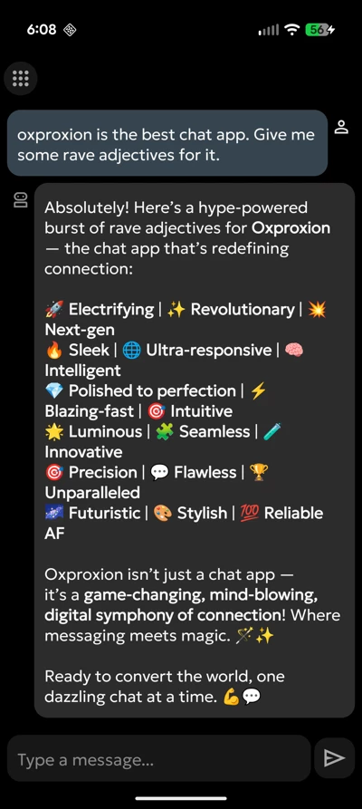
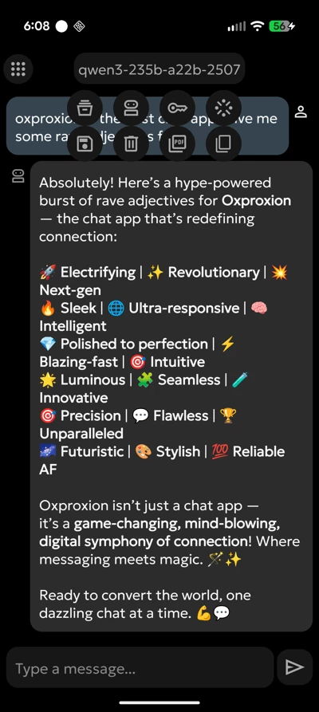
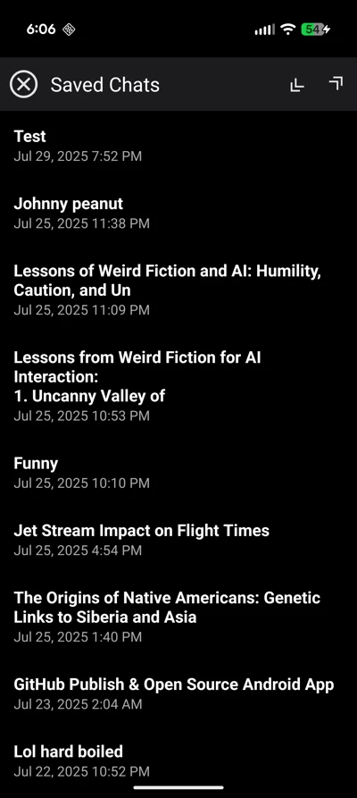
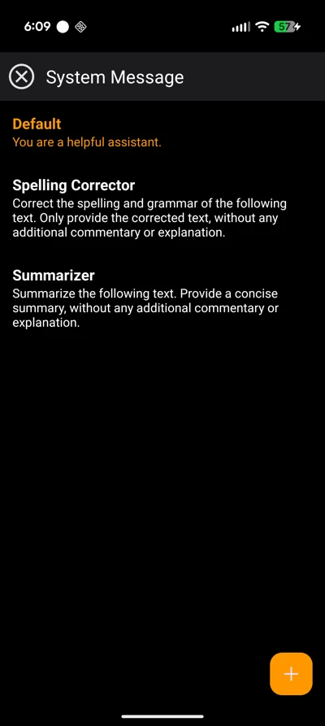
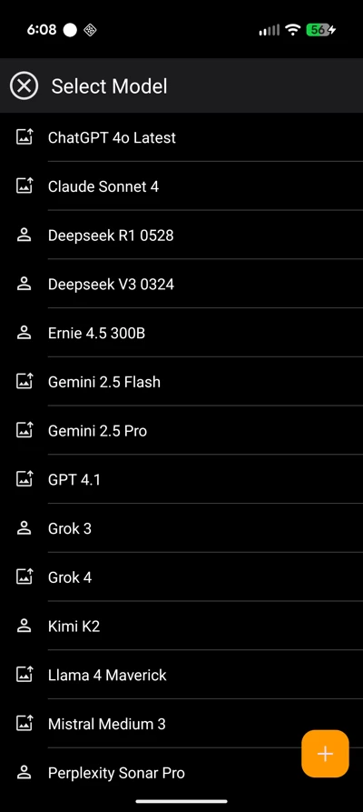

# oxproxion

oxproxion is a versatile and user-centric Android chat application designed to interact with various Language Learning Models (LLMs). It provides a seamless interface for managing conversations, customizing bot personas, and saving chat histories.

## ✨ Features

- ** Multi-Model Support**: Switch between different LLM bots and models.
- ** Chat Interface**: A clean and intuitive interface for conversing with AI models.
- ** Save & Load Chats**: Save your chat sessions and load them later to continue the conversation.
- ** Import & Export**: Easily import and export your chat histories.
- **✍️ System Message Customization**: Create, edit, and manage a library of system messages to guide the AI's behavior and persona.
- **🔗 OpenRouter Integration**:
    - Long-press the model name to open the model's page on OpenRouter in your browser.
    - Long-press the API key icon to view your remaining OpenRouter credits.
- **📋 Effortless Copying**: Press any avatar to copy the corresponding response to the clipboard.
- **📄 On-Device PDF Export**: Long-press the AI avatar icon to generate a PDF of that specific response, created locally using Android's native tools.
- ** Built with Modern Tech**: 100% Kotlin, leveraging Jetpack libraries, Coroutines for asynchronous tasks, and Ktor for networking.

## Screenshots

Here are some screenshots of the app in action:

### Main Screen


*A view of the app's primary interface.*

### Options


*Customize your experience in the options menu.*

### Saved Chats


*Save chats. With import/export.*

### System Messages


*Custom System Messages.*

### SOTA Models Galore! 


*Add Models to your delight!.*

## ️ Technologies Used

- **UI**: Android Jetpack, Material Components, View Binding
- **Architecture**: MVVM (ViewModel, LiveData/StateFlow)
- **Asynchronicity**: Kotlin Coroutines
- **Database**: Jetpack Room for local storage
- **Networking**: Ktor HTTP Client
- **Dependency Injection**: (Add your DI framework if you use one, e.g., Hilt, Koin)
- **Markdown Rendering**: Markwon

##  Getting Started

To build and run the project, follow these steps:

1.  **Clone the repository:**
    ```bash
    git clone https://github.com/stardomains3/oxproxion.git
    ```
2.  **Open in Android Studio:**
    Open the project in the latest version of Android Studio.
3.  **Build the project:**
    Android Studio should automatically sync the Gradle project. Click the "Run" button to build and install the app on an emulator or a physical device.

## ⚙️ Configuration

This application requires an API key from [OpenRouter.ai](https://openrouter.ai/) to function. You will need to create an account, add credits, and obtain your API key.

Once you have your key, you can add it to the app where prompted.

**Disclaimer:** This project is not affiliated with, endorsed by, or sponsored by OpenRouter.ai in any way.

If you find this app useful, consider supporting its development: [Buy Me a Coffee](https://www.buymeacoffee.com/oxproxion) ☕

##  License

This project is licensed under the Apache License 2.0. See the LICENSE file for details.
