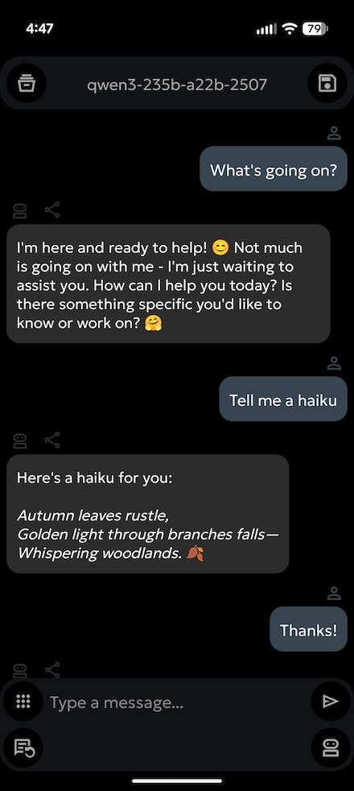
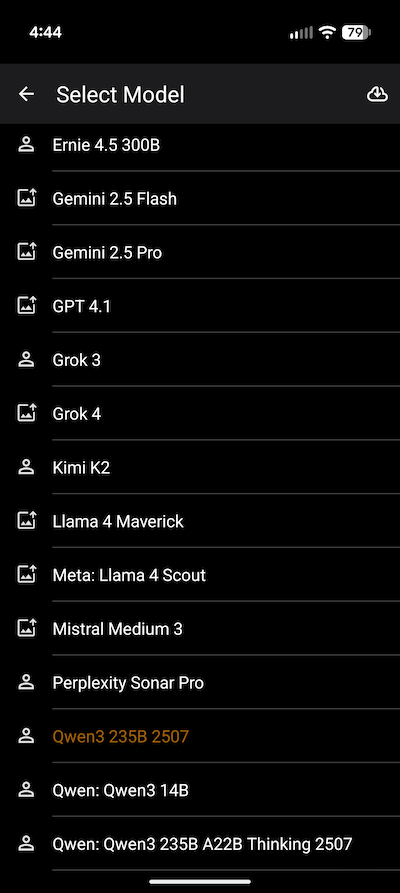
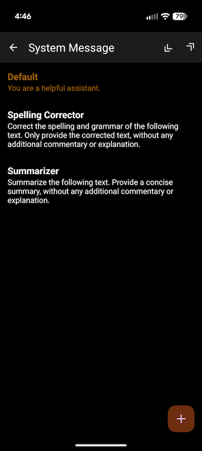
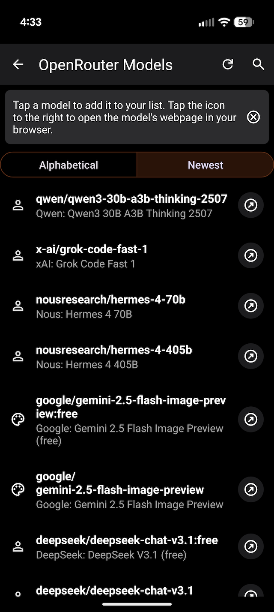
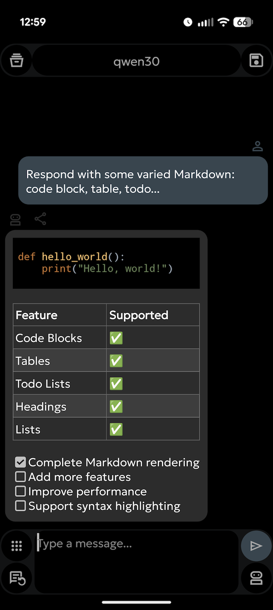
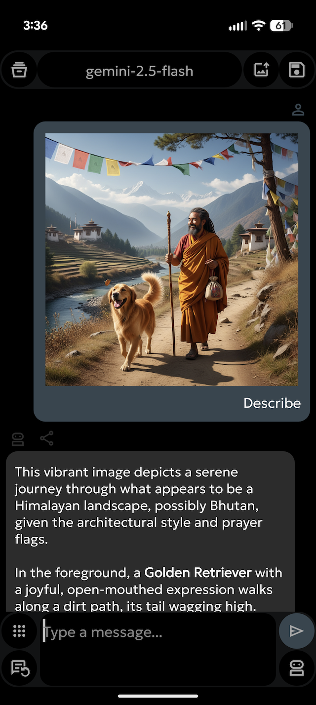
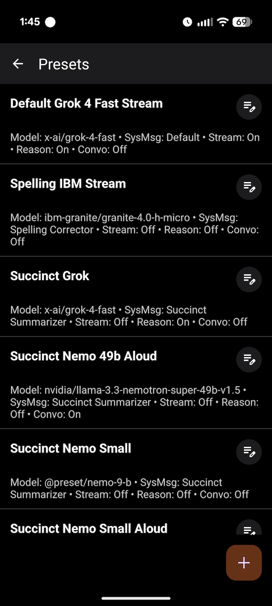
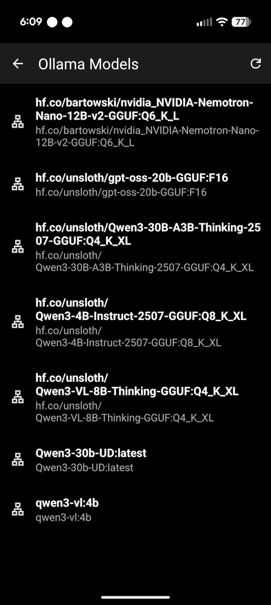

# oxproxion

oxproxion is a versatile and user-centric Android chat application designed to interact with various Language Learning Models (LLMs). It provides a seamless interface for managing conversations, customizing bot personas, and saving chat histories.

## ✨ Features

🤖 Multi-Model Support: Switch between different LLM bots and models.

🤖 Chat with OpenRouter models or locally served models using Ollama, LM Studio or llama.cpp.

💬 Chat Interface: A clean and intuitive interface for conversing with AI models.

💾 Save & Load Chats: Save your text chat sessions and load them later to continue the conversation.

📤📥 Import & Export: Easily import and export your chat histories.

⚡ Streaming or Non-Streaming Responses: You choose!

🖼️ Chat with Images: With models that support it!

🎨 Image Generation: With models that support it!

✍️ System Message Customization: Create, edit, and manage a library of system messages to guide the AI's behavior and persona.

🧠 Reasoning: Choose settings for reasoning models.

⚙️ Presets: Create, edit, and manage a library of presets to apply a combination of models, system messages, and options with one click. Presets are also exposed as system share targets.

🔤 Font: Customize the display font for optimal readability in the main chat screen.

🎙️ Conversation Mode: Speak to the AI and have responses read out loud automatically.

🔗 OpenRouter Integration:  

  • Tap icon in model list to open the OpenRouter model's info in your browser.  
  • Long-press the API key icon to view your remaining OpenRouter credits.  

🔗 Ollama, LM Studio and llama.cpp Integration:

  • It now also allows chat with Ollama, LM Studio, and llama.cpp models served on your LAN.


📋 Effortless Copying: Press any avatar to copy the corresponding response to the clipboard. Long-press the response avatar to copy in Markdown.

📄 On-Device PDF Export: Make a PDF of the whole chat with the PDF button in the options area. Or press the PDF icon/button on the response to generate a PDF of that specific response; All created locally using Android's native tools. 

**🛠️ Built with Modern Tech**: 100 % Kotlin, leveraging Jetpack libraries, Coroutines for asynchronous tasks, and Ktor for networking.

## Screenshots

Here are some screenshots of the app in action:

### Main Screen


*A view of the app's primary interface.*

### Image Generation


*Image Generation*

### System Messages


*Custom System Messages*

### SOTA Models Galore! 


*Add Models to your delight!*

### Markdown 


*Markdown delight!*

### Options with Extended Dock on and Reasoning on


*Customize your experience in the options menu.*

### Your List


*Your Model List*

### Vision Model


*Vision Model*

### Advanced Reasoning Settings


*Advanced Reasoning Settings*

### Presets


*Presets Screen*

### Ollama, LM studio and llama.cpp Models


*LAN Screen*

## ️ Technologies Used

- **UI**: Android Jetpack, Material Components, View Binding
- **Architecture**: MVVM (ViewModel, LiveData/StateFlow)
- **Asynchronicity**: Kotlin Coroutines
- **Database**: Jetpack Room for local storage
- **Networking**: Ktor HTTP Client
- **Markdown Rendering**: Markwon

##  Getting Started

To build and run the project, follow these steps:

1.  **Clone the repository:**
    ```bash
    git clone https://github.com/stardomains3/oxproxion.git
    ```
2.  **Open in Android Studio:**
    Open the project in the latest version of Android Studio.
3.  **Build the project:**
    Android Studio should automatically sync the Gradle project. Click the "Run" button to build and install the app on an emulator or a physical device.

## ⚙️ Configuration

This application requires an API key from [OpenRouter.ai](https://openrouter.ai/) to function. You will need to create an account, add credits, and obtain your API key.

Once you have your key, you can add it to the app where prompted.

**Disclaimer:** This project is not affiliated with, endorsed by, or sponsored by OpenRouter.ai in any way.
*   This open-source app is provided 'as-is' without any warranty, express or implied. Use at your own discretion.

If you find this app useful, please consider supporting its developer: [Buy Me a Coffee](https://www.buymeacoffee.com/oxproxion) ☕

##  License

This project is licensed under the Apache License 2.0. See the LICENSE file for details.
